# MTS standard application tempalte

# `mts-s-template`

## Foreword

The TcOpen group if funded by [MTS](https://www.mts.sk) to develop this application for its own use. We are also making it freely available to the wider community for use or inspiration.

The application template will therefore be developed primarily to meet the needs of MTS. We will of course accept input from the community, but some limits may be imposed on any changes of this particular template.
However, TcOpen will develop different application templates that will be more open to change from the community.

## Prerequisites

### TcOpen framework prerequisites

Checkout general prerequisites for TcOpen framework [here](https://github.com/TcOpenGroup/TcOpen/blob/dev/README.md#prerequisites).

### Template-specific prerequisites

- This template uses RavenDB for storage, **embedded** into the application (for convenience), thus you will need [to register the installation](https://ravendb.net/buy). There is a community edition that you can use for free.
- Embedded instance is good for testing and commissioning, however, in production you should use a non-embedded instance. Instructions [here](https://github.com/TcOpenGroup/TcOpen/tree/dev/src/TcoData/src/Repository/RavenDb#how-to-install-it).

## Overview

This application aims to provide scaffolding for automated production/assembly machinery such as:

- single assembly station.
- a group of standalone assembly stations with an ID system.
- conveyor-based assembly and testing lines with an ID system.
- carousel tables with an ID system.

The production environment is represented by a series of hierarchically organized units where:

> **Technology** encapsulates all stations/units and it is the root/top-level block.
>> **Controlled unit** represents a station or a unit that performs compact series of operations.

>>>**Components** represent all physical or virtual components used by the Controlled unit.

>>>**Tasked sequences** represent a series of actions organized sequentially (controlled unit contains by default ground and automat sequence).

>>>**Tasked services** represent a series of actions organized arbitrarily (controlled unit contains by default manual/service tasked service).


## Application


- `Application settings`

    Application settings class is located in connector project `ukazkaPlcConnector`. This project is referenced in `ukazkaHmi.Wpf`, and might be referenced in others HMI apps(Supervisor,OperatorPanel..) Here you can find most common settings witch are used to run application.

~~~csharp
 public class ApplicationSettings
    {

        public DeployMode DepoyMode{ get; set; } = DeployMode.Plc;
        public DatabaseEngine DatabaseEngine { get; set; } = DatabaseEngine.MongoDb;
        public string PlcAmsId =Environment.GetEnvironmentVariable("Tc3Target");
        public bool ShowConsoleOutput { get; set; } = false;

        public int ReadWriteCycleDelay { get; set; } = 100;

        public string DbName { get; set; } = "tcomtsukazka";
        public string MongoPath {get;set;} = @"C:\Program Files\MongoDB\Server\3.6\bin\mongod.exe";
        public string MongoArgs { get; set; } = "--dbpath D:\\DATA\\DB\\ --bind_ip_all";
        public bool MongoDbRun { get; set; } = true;
        private string MongoDbLocal { get; set; } = @"mongodb://localhost:27017";
        private string MongoDbProduction { get; set; } = @"mongodb://localhost:27017";
        private string RavenDbLocal { get; set; } = @"http://localhost:8080";
        private string RavenDbProduction { get; set; } = @"http://localhost:8080";

        //Verbose - tracing information and debugging minutiae; generally only switched on in unusual situations
        //Debug - internal control flow and diagnostic state dumps to facilitate pinpointing of recognised problems
        //Information - events of interest or that have relevance to outside observers; the default enabled minimum logging level
        //Warning - indicators of possible issues or service/functionality degradation
        //Error - indicating a failure within the application or connected system
        //Fatal - critical errors causing complete failure of the application
        public Serilog.Events.LogEventLevel LogRestrictedToMiniummLevel { get; set; } = Serilog.Events.LogEventLevel.Information;
        /// <summary>
        /// Capped size  max size of logs collection in MB
        /// </summary>
        public long CappedMaxSizeMb { get; set; } = 1000;
        /// <summary>
        /// Max documents in logs collection 
        /// </summary>
        public long CappedMaxDocuments { get; set; } = 1000000;

        // USER
        public string AutologinUserName { get; set; } = "admin";
        public  string AutologinUserPassword { get; set; }= "admin";

        public  string GetConnectionString()
        {
            var connectionString = DatabaseEngine == DatabaseEngine.MongoDb ? MongoDbProduction : RavenDbProduction;
            if (DepoyMode == DeployMode.Local)
            {
                connectionString = DatabaseEngine == DatabaseEngine.MongoDb ? MongoDbLocal : RavenDbLocal;
            }
            return connectionString;
        }

    }
    public enum DeployMode
    {
        Local = 1,
        Dummy = 2,
        Plc = 3
    }
    public enum DatabaseEngine
    {
        RavenDbEmbded = 1,
        MongoDb = 2,

    }
~~~

   - `Serialize/Deserialize AppSettings`

Settings are serialized automatically, but only if file does not exist in location  `c:\TcoData\`+`setId`. It is saved as `json` format. Location is defined in application settings of `ukazkaPlcConnector` project. Is possible to use various 'setId' for multiple applications.

---
**NOTE**

If settings file exist in defined location, all application settings is deserialized from this file! To change some parameters remove this file and change it in code (will be published new file) or change set in file directly.

---

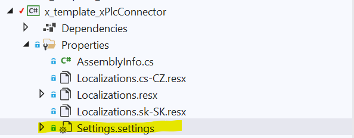


   ~~~csharp
    /// <summary>
        /// Load specific parameters stored in json file stored in 'ukazkaPlcConnector.Properties.Settings.Default.SettingsLocation'
        /// </summary>
        /// <param name="setId">Name for set</param>
        public static void LoadAppSettings(string setId)
        {

            RepositoryDataSetHandler<ApplicationSettings> _settings = RepositoryDataSetHandler<ApplicationSettings>.CreateSet(new JsonRepository<EntitySet<ApplicationSettings>>(new JsonRepositorySettings<EntitySet<ApplicationSettings>>(Properties.Settings.Default.SettingsLocation)));//todo tco adresar
            var result = _settings.Repository.Queryable.FirstOrDefault(p => p._EntityId == setId);
            var set = new EntitySet<ApplicationSettings>();
            set._Modified = DateTime.Now;
            set._EntityId = setId;
            if (result == null)
            {
                set._Created = DateTime.Now;
              
                _settings.Create(setId, set);
            }

            Entry._settings = _settings.Read(setId).Item;

            plc = Entry._settings.DepoyMode == DeployMode.Dummy
                ? new ukazkaPlcTwinController(new ConnectorAdapter(typeof(DummyConnector)))
                : Entry._settings.DepoyMode == DeployMode.Local
                    ? new ukazkaPlcTwinController(Tc3ConnectorAdapter.Create(851, Settings.ShowConsoleOutput))
                    : new ukazkaPlcTwinController(Tc3ConnectorAdapter.Create(Entry._settings.PlcAmsId, 851, Settings.ShowConsoleOutput));
        }
   ~~~

- `Load settings and example usage`

    Example in `App.xaml.cs`
   
    ~~~csharp  

    Entry.LoadAppSettings("default");
    .
    .
    .
     .SetUpLogger(new TcOpen.Inxton.Logging.SerilogAdapter(new LoggerConfiguration()
                                        .WriteTo.Console()
                                        .WriteTo.MongoDBBson($@"{Entry.Settings.GetConnectionString()}/{Entry.Settings.DbName}","log",
                                                    Entry.Settings.LogRestrictedToMiniummLevel, 50, TimeSpan.FromSeconds(1), Entry.Settings.CappedMaxSizeMb, Entry.Settings.CappedMaxDocuments)
                                        .WriteTo.File(new Serilog.Formatting.Compact.RenderedCompactJsonFormatter(), "logs\\logs.log")
    ~~~

- `First run`
    After successful start up template application is necessary assign roles to logged user, in template it is `admin`(see procedure below).

- `1`

    Admin is connected (because of autologin), but  still does not have assigned roles.

    

- `2`

    Open `Users` tab  and then in `Group management` assign required roles to this group.

    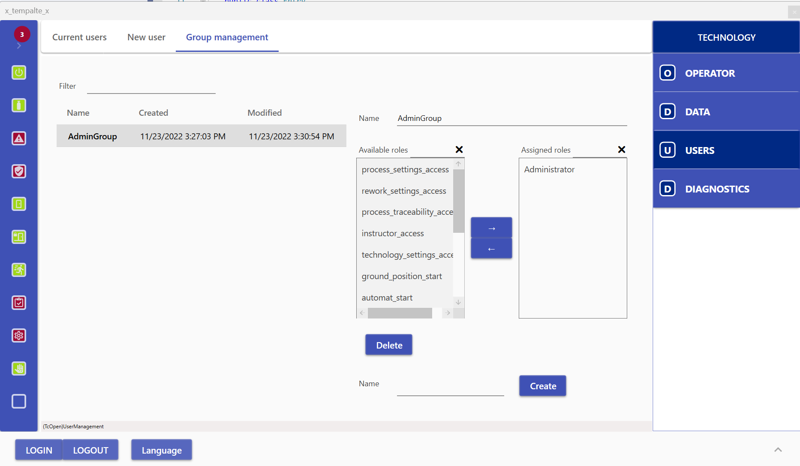

    

- `3`

        Login again and you have admin access to control application.


- `Localization settings`

defined in `App.xaml.cs`

~~~csharp
      SetCulture();
~~~
It is possible to add additional culture in this method. After change language application will be restarted with new language.git 
~~~csharp
  private static void SetCulture()
        {
            Culture = Settings.Default.Culture;
            CultureInfo ci = new CultureInfo(Culture);
            Thread.CurrentThread.CurrentCulture = ci;
            Thread.CurrentThread.CurrentUICulture = ci;
            LanguageSelectionModel = new LanguageSelectionViewModel();
            LanguageSelectionModel.AddCulture("sk-SK", Path.Combine(Assembly.GetExecutingAssembly().Location, @"\..\..\..\Assets\CulturalFlags\sk.png"));
            LanguageSelectionModel.AddCulture("cs-CZ", Path.Combine(Assembly.GetExecutingAssembly().Location, @"\..\..\..\Assets\CulturalFlags\cz.png"));
            LanguageSelectionModel.AddCulture("en-US", Path.Combine(Assembly.GetExecutingAssembly().Location, @"\..\..\..\Assets\CulturalFlags\us.png"));
        }
~~~


## Data-driven production process

The production flow is typically organized in sequences driven by a set of data called **Production settings**.

- `Production settings`  is a structure that contains settings to instruct the production flow (inclusion/exclusion of actions, limits, required values, etc.) as well as placeholders for data that arise during the production (measurement values, detected states, data tags of included components, etc.). Production setting and traceability data have the same structure so that settings and traced data are collected in a single data set.

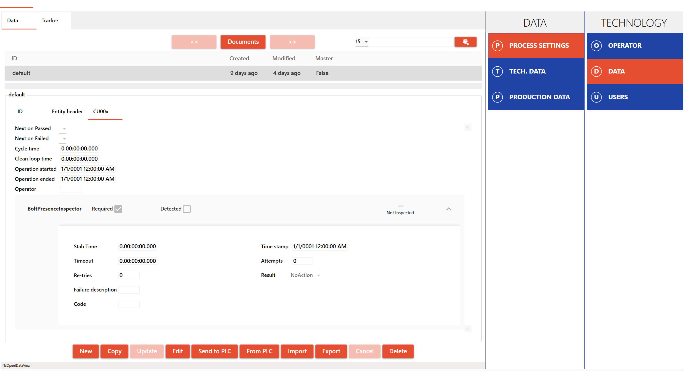

- `Technological settings` is a structure containing data that does not relate directly to the production process, but rather to the setting of the technology (sensor calibration values, pick and place positions, etc.)

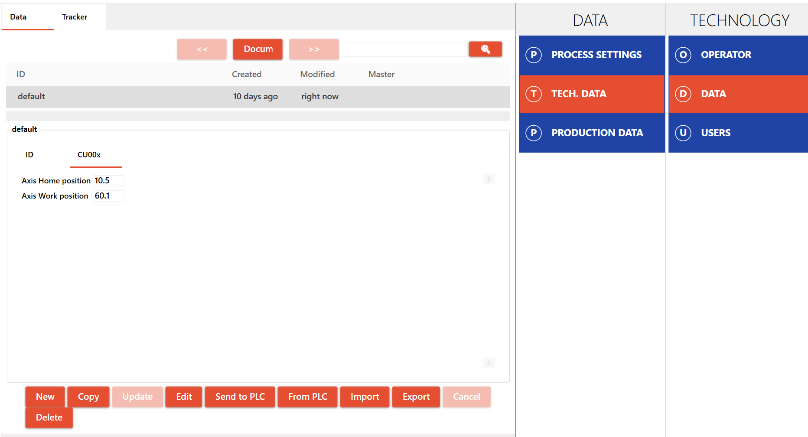

### Data and production flow

The first station (controlled unit) in the production chain loads the current set of production data to the assembly parts, that are assigned to that part. The data set contains information about the entire production process (all station settings are included).

#### Entity header

Each part has an *Entity header* that contains information about the flow and status of the given part.

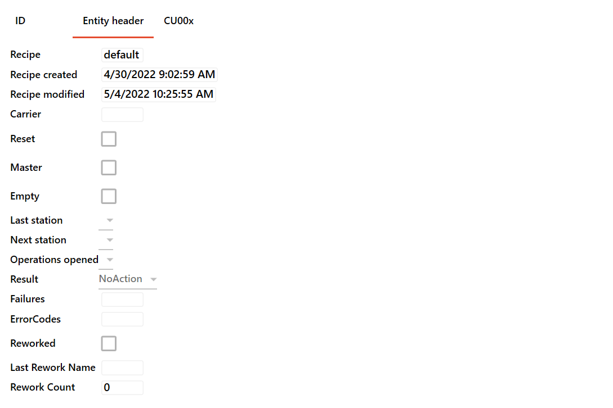

- `Recipe` contains the name of the production setting data set.
- `Recipe created` date and time of recipe creation.
- `Recipe modified` date and time of last recipe modification.
- `Carrier` is the identifier of the mean of transport of the production part (pallet, carousel table position, etc).
- `Reset or ground position performed` indicates when station reset occurred while the part was at the station.
- `Is Master` indicates that the part is special (verification, process checking etc.)
- `Is Empty` indicates that the carrier is empty, no parts were loaded.
- `Last station` is the last station where the part was processed in the production chain.
- `Next station` is the next destination station for the part to be processed.
- `Operations Opened` Indicates the station where the part is being processed.
- `Result` Indicates the status of the part (NoAction, InProgress, Passed, Failed)
- `Failures` verbatim description of failures that occurred during the processing of the part.
- `ErrorCodes` error codes that occurred during the processing of the part.
- `Was reworked` indicates that the part underwent rework.
- `Last rework name` name of the rework applied to the part.
- `Rework count` number of times the part has undergone reworks.

#### Controlled unit header

Each station (controlled unit) has a header that contains a set of information:


- `Next station on fail` sets where the part should go when the process on a given station fails.
- `Next station on passed` sets where the part should go when the process passes.
- `Cycle time` cycle time on a given station when the part was processed.
- `Clean loop time` clean cycle time (without carrier exchange) on a given station when the part was processed.
- `Operation started`  start operations time stamp on a given station.
- `Operation ended` end operations time stamp on a given station.
- `Operator` name or id of the operator logged into the given station while the part was processed.

### How data is handled on the stations (controlled units)

**Creating entity**: The first station in the chain of production loads *Process settings* to the part (entity) and opens the part for production (Result := InProgress).

**Opening entity**: Each consecutive station retrieves the data of the given part by its ID then checks whether it belongs to the station by checking that EntityHeader.NextStation matches the ID of the station. If the NextStation and ID match the station will start its operation on the part, otherwise it will be released from the station without performing any tasks. If the station executes its operations on the part it will record it to the Entity Header (assigns id of the station to Entity header's Operations Opened). The process adheres to the settings available for the station. During the process the station also fills in the traceability data (measurements, detection, ids of assembled parts, etc.).

**Closing entity**: At the end of the operation the part data structure is closed for editing and the NextStation is assigned (depending on the result of the operations). The data are pushed back to a data repository for later retrieval in the next station.

**Finalizing entity**: The last station in the production chain should finalize the part when the **InProgress** result changes into the overall result **Passed**, while the failed result remains marked as **Failed**.

A special case occurs if **reset or ground position** is triggered on a station. When the station is reset while operations on a part are in progress (Operation Opened is a station ID) then the reset results in the entity being marked as failed. If the station is reset and operations are not in progress then the status of the entity is not modified.

# Application template architecture

The application's entry point is the `MAIN` program called cyclically from the PLC task.
`MAIN` declares the instance of the `Technology` type that is the context of the whole application. You should place all your code within the `Main` method of technology object (`_technology.Main()`) that will contextualize all your code.

If you are not familiar with the architecture of the TcOpen framework `context` concept, you can find more
[here](https://docs.tcopengroup.org/articles/TcOpenFramework/TcoCore/TcoContext.html) or a more generic overview [here](https://docs.tcopengroup.org/articles/TcOpenFramework/TcoCore/Introduction.html).

*Following video introduces the application context*

[](http://www.youtube.com/watch?v=Nr8Y-5GHSxE)

# Technology object

`Technology` is **top/root object** of a comprehensive whole (production line, series of devices chained in an orderly fashion) that controlled by one PLC. The `technology` contains `controlled units` representing sufficiently autonomous parts of the technology (e.g., stations, devices, etc.).

## Technology commands

### GroundAll

The task that provides execution of the ground task to all controlled units within the technology. The ground task of each controlled unit should contain the control logic that brings the respective controlled unit into its initial state.

### AutomatAll

The task that provides the execution of the automatic task to all controlled units within the technology. Automat task provides each controlled unit's nominal (automatic) cycle logic.

## Controlled units

The technology can contain multiple controlled units. The controlled unit has different `modes`:

- **Ground**: brings the device into its initial state (home position, state resets, etc.). The ground mode can contain subsequences for parallelization or organization of logic.
- **Automat**: represents the standard run of the unit. Automat mode is of sequence type. The automat mode can contain subsequences for parallelization or organization of logic.
- **Manual**: provides access to a series of tools to manipulate single components of the controlled unit.

>More about sequences: [formal explanation](https://docs.tcopengroup.org/articles/TcOpenFramework/TcoCore/TcoSequencer.html), [informal explanation](https://docs.tcopengroup.org/articles/TcOpenFramework/howtos/How_to_write_a_sequence/article.html)

>More about tasks: [formal explanation](https://docs.tcopengroup.org/articles/TcOpenFramework/TcoCore/TcoTask.html).

Controlled units also contain two main structures:

- **Components** encapsulates components (drives, sensors, pneumatical cylinders, etc.)
- [**ProcessData**](#processdata) is a PLC's working copy of its recipe and traceability data combined, that is kept in a repository ([TcoData](https://docs.tcopengroup.org/articles/TcOpenFramework/TcoData/Introduction.html)).


## ProcessData

This application template provides a versatile model to allow for the extended control of the program flow from a manageable data set. Process data represent the set of information to follow and process during production. One way of thinking about the process data is as the recipe that, besides the instructive data, contains information that arises during the production process. Production data are filled into the data set during the production operations.

Typically, the process data are loaded at the beginning of the production into the first controlled unit (station). Then, an Id of the production entity is assigned and stored in the data repository. Each controlled unit (station) later retrieves the data for the given entity at the beginning of the process and returns the data (enriched by additional information about the production) to the repository at the end of the process.

## TechnologicalData

Technological data contain a manageable set of data related to the technology used, such as drives settings, limits, global timers, etc.

## ProcessTraceability

Process traceability is a PLC placeholder for accessing the production data repository. This object points to the same traceability repository as the `ProcessData` of any controlled unit.

# Controlled unit templates

Controlled unit `CU00X` is a template from which other controlled units can derive.
`CU00X` folder contains a template from which any controlled unit can be scaffolded. There is PowerShell script `Create-Controlled-Unit` located in the root of the solution directory for this purpose.

~~~
.\Create-Controlled-Unit.ps1 NEWCU
~~~

> The script may not work as expected when the solution is opened as filtered solution (slnf).

Running the script will modify the PLC project files; if the project is opened in the visual studio a project reload will be required. In addition, you will need to add the call of the newly added controlled unit in the `Technology` manually.

~~~csharp
FUNCTION_BLOCK Technology EXTENDS TcoCore.TcoContext
VAR
    _processSettings     : ProcessDataManager(THIS^);
    _technologySettings  : TechnologicalDataManager(THIS^);
    _processTraceability : ProcessDataManager(THIS^);
    {attribute addProperty Name "<#AUTOMAT ALL#>"}
    _automatAllTask : TcoCore.TcoTask(THIS^);
    {attribute addProperty Name "<#GROUND ALL#>"}
    _groundAllTask : TcoCore.TcoTask(THIS^);
    _cu00x         : CU00x(THIS^);
    
    _NEWCU : NEWCU(THIS^); <------ NEWLY ADDED
END_VAR
//-----------------------------------------------------

Main() <------ ATTENTION NOT BODY OF THE FUNCTION BLOCK BUT Main() METHOD!!!
//----------------------------------------------------
_processSettings();
THIS^.RtcSynchronize(true, '', 60);
_cu00x();

_NEWCU();  <------ NEWLY ADDED

//----------------------------------------------------
~~~

# Data handling #

The usage of methods for  handling `ProcessData` are described on picture below. Controlled unit in template has a basic scheme for data handling. On first controlled unit is necessary load a `LoadProcessSettings`(Recipe). This method is usually used on first at Cu001(start of process) or can be called on each controlled unit.

If there is a Process traceability and  PLC is placeholder for accessing the production data repository, then is necessary call `DataEntityCreateNew` with specified `_entityId`. The method  `EntityDataOpen` load data from repository and check flow in header. If entity belongs to controlled unit sequence can start (operation start time stamp, user info, etc are populated in header). This method is usually called on each stations at beginning of the sequence.

`DataEntityClose` is typically used after all operation on the technology are completed (operation end time stamp, user info, flow to next and etc are populated in header).


## LoadProcessSettings ##

 Typically used in the first station of the technology to load process settings that will be used trough out the production

~~~csharp
       
 IF(Station.Technology.ProcessSettings.Data._EntityId <> '' AND NOT THIS^._missingProcessSettingMessage.Pinned) THEN
  IF(Station.Technology.ProcessSettings.Read(Station.Technology.ProcessSettings.Data._EntityId).Done) THEN
   Station.ProcessDataManager.Data := Station.Technology.ProcessSettings.Data;
   Station.ProcessDataManager.Data.EntityHeader.RecipeCreated := Station.Technology.ProcessSettings.Data._Created;
   Station.ProcessDataManager.Data.EntityHeader.RecipeLastModified  := Station.Technology.ProcessSettings.Data._Modified;
   Station.ProcessDataManager.Data.EntityHeader.Recipe  := Station.Technology.ProcessSettings.Data._EntityId;    
   Station.ProcessDataManager.Data._EntityId := ULINT_TO_STRING(Context.RealTimeClock.TickClock());
   CompleteStep();

  END_IF; 
 ELSE
  IF(_dialog.Show()
        .WithCaption('<#Process data not selected#>')
     .WithText('<#Would you like to load default settings?#>')
     .WithYesNoCancel().Answer = TcoCore.eDialogAnswer.Yes) THEN
     
      Station.Technology.ProcessSettings.Data._EntityId := 'default';
  END_IF; 

   
 END_IF          
~~~

## DataEntityCreateNew ##

 Creates new data entity (new part/item). Typically used in the first station of the technology to create new document/record to be persisted in the repository.Sets the status of the entity to `InProgress`

~~~
THIS^.DataEntityCreateNew(200, Station.ProcessDataManager.Data._EntityId, Header := Station.ProcessDataManager.Data.CU00x.Header); END_IF;
~~~

## EntityDataOpen ##

Populates the information in the data header of this controlled unit (operation start time stamp, user info, etc) Typically used prior to starting operation within a controlled unit.

~~~
THIS^.DataEntityOpen(300,30000, Station.ProcessDataManager.Data._EntityId,Station.ProcessDataManager.Data.CU00x.Header)
~~~

## DataEntityClose ##

Populates the information in the data header of this controlled unit (operations end time stamp, user info, etc). Typically used after all steps within the controlled unit are completed.

The status of the entity is still **'InProgress'**

~~~
IF(_dataClose) THEN THIS^.DataEntityClose(5000, eDataEntityInvokeType.InvokeAndWaitDone ,Station.ProcessDataManager.Data.CU00x.Header); END_IF;
~~~

## DataEntityFinalize ##

 Same as `DataCloseEntity` populates the information in the data header of this controlled unit (operations end time stamp, user info, etc)
 Typically used after all operation on the technology are completed (end of the process).

Sets the status of the entity to **Passed**

~~~
THIS^.DataEntityFinalize(5500,eDataEntityInvokeType.InvokeOnly,Station.ProcessDataManager.Data.CU00x.Header);
~~~

**Note!**

- If input enum parameter in methods `DataCloseEntity` and `DataCloseFinalize`  is set to **InvokeAndWaitDone**  operation will  wait until task reaches the ```Done``` state .

- If input enum is set to **InvokeOnly** results return True when  task reaches the ```Busy``` state .This option is used when we need to reduce cycle time. Later is recommended (necessary) to check  task  ```Done``` state  , check  task  status.

    ~~~csharp
    //save data
    THIS^.DataEntityFinalize(5500,eDataEntityInvokeType.InvokeOnly,Station.ProcessDataManager.Data.CU00x.Header);


    //some steps (robots, cylinder to home positions...)

    //later check if saving data process is done
    IF (Step(20000,TRUE , 'WAIT FOR IF DATA FINALIZE IS DONE')) THEN
        //-------------------------------------

            StepCompleteWhen(Station.UpdateEntityTask.Done );
        
        //------------------------------------- 
    END_IF
    ~~~

# Notification panel #

Use of this visual component is provide to a brief overview of `Technology`.  Essential signals in Technology such a **Control Voltage, Air pressure, Safety....** are displayed on this panel on *Main Screen*.

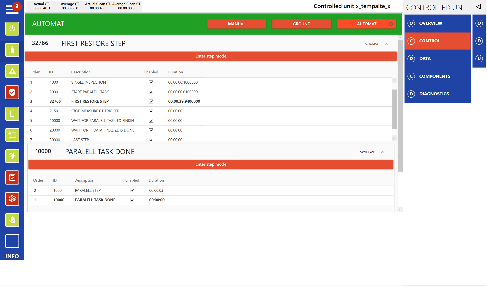


Component is populated from plc   and  provide simple diagnostic if technology is ready for operation.

~~~csharp
//notification panel
//messanging is suspensded 
 Context.Environment.Messaging.Suspend();
   
_closed:=TRUE;
//_closed   :=  Components.Safety.DoorCircuits.DoorCircuit_2.IsClosed 
//   AND Components.Safety.DoorCircuits.DoorCircuit_3.IsClosed  
//   AND Components.Safety.DoorCircuits.DoorCircuit_4.IsClosed  
//   AND Components.Safety.DoorCircuits.DoorCircuit_5.IsClosed  
//   AND Components.Safety.DoorCircuits.DoorCircuit_6.IsClosed;

 _locked:=TRUE;
//_locked   :=  Components.Safety.DoorCircuits.DoorCircuit_2.IsLocked 
//   AND Components.Safety.DoorCircuits.DoorCircuit_3.IsLocked  
//   AND Components.Safety.DoorCircuits.DoorCircuit_4.IsLocked  
//   AND Components.Safety.DoorCircuits.DoorCircuit_5.IsLocked  
//   AND Components.Safety.DoorCircuits.DoorCircuit_6.IsLocked;
   
_keysAto  := TRUE;
_eStopActive:=0;


_notificationSourceSignals.ControlVoltage   := TRUE;//Components.ControlVoltage.Signal.Signal 
_notificationSourceSignals.AirPressure      := TRUE;//Components.AirPressureOk.Signal.Signal, 
_notificationSourceSignals.AutomatAllowed   := _keysAto; 
_notificationSourceSignals.EmergencyStop    := _eStopActive > 0; 
_notificationSourceSignals.SafetyDoorOk     :=safetyCircuitOk; 
_notificationSourceSignals.LightCurtain     := TRUE;  // not used
_notificationSourceSignals.DoorClosed       := _closed; 
_notificationSourceSignals.DoorLocked       := _locked; 
_notificationSourceSignals.ProcessDataOk    := _processSettings._data._EntityId <> '';
_notificationSourceSignals.TechnologyDataOk := _technologySettings._data._EntityId <> '';  
 
_notificationPanel(inBlinkPeriod:=T#500MS , inSignalSource:=_notificationSourceSignals );
   
 Context.Environment.Messaging.Resume();

~~~

**Note!**
It is possible to use like a **sub module diagnostic** (only one Cu, group of Cu or whole Technology)

# Production Planner #

 Production planer is a tool that allowe us to plan  production. It is a table configurator. Planer UI allows you to choose the appropriate recipe and set required amount of production. Usualy planer is used in automatic process , but can be used on manual station like guidance for operator.

On picture below is  shown planer during production.

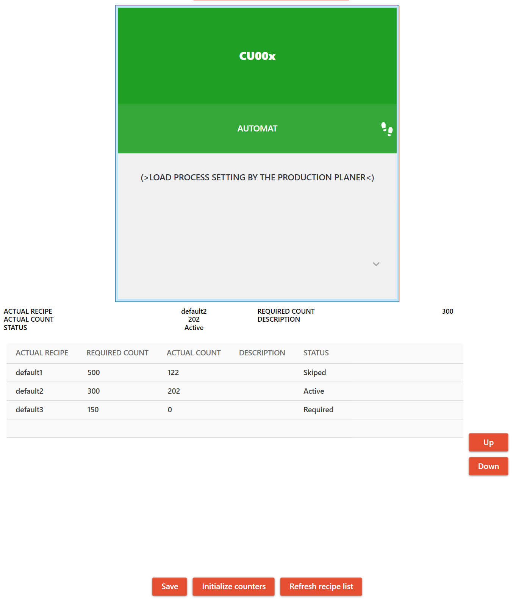

- **ActualRecipe** - appropriate recipe name (column is a combobox with all available recipes)
- **RequiredCount** - required amount of product
- **ActualCount** - actual counter value
- **Description** - it is optional field, it is used for note e.g.
- **Status** - it is general state for actual row.

~~~ csharp
  public enum EnumItemStatus
    {
        None = 0,   //
        Required = 10,
        Active = 20,
        Done = 30,
        Skiped = 50,
        AllCompleted =100

    }
~~~

- None - default value
- Required - requred not started
- Active - active current production
- Done -recipe has ben done
- Skiped - it is in list but in production is skipped 
- AllCompleted - whenl planer finish all required recipes this value is set.

## Commands ##
- **Save** save actual set
- **Initialize counters** Set the counter value to zero for all items
- **Refresh recipe list** by this command is updated list of recipe.(is updated when application starts )
- **Up/Down**  selected item can be moved  in collection (the possiblility to change the production order) 

## Production Planner Empty ##

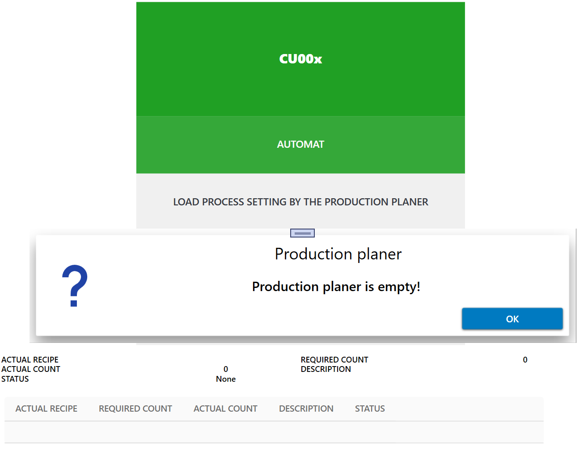

# Production Planner Completed #


Definition in App.xaml.cs
~~~cshartp

//Production planer         
var _productionPlanHandler = RepositoryDataSetHandler<ProductionItem>.CreateSet(new RavenDbRepository<EntitySet<ProductionItem>>(new RavenDbRepositorySettings<EntitySet<ProductionItem>>(new string[] { Constants.CONNECTION_STRING_DB }, "ProductionPlan", "", "")));

ProductionPlaner = new ProductionPlanController(_productionPlanHandler, "ProductionPlanerTest", new RavenDbRepository<PlainProcessData>(ProcessDataRepoSettings));

Action prodPlan = () => GetProductionPlan(ukazkaPlc.MAIN._technology._cu00x._productionPlaner);
ukazkaPlc.MAIN._technology._cu00x._productionPlaner.InitializeExclusively(prodPlan);
~~~

ViewModel 
~~~
ProductionPlanViewModel = new ProductionPlanViewModel(App.ProductionPlaner);

public ProductionPlanViewModel ProductionPlanViewModel { get; private set; }
~~~

View
~~~
<view:ProductionPlanView Grid.Row="2" DataContext="{Binding ProductionPlanViewModel}"></view:ProductionPlanView>

~~~

Plc remote call

~~~ csharp
							   
	 IF Station.ProductionPlanerTask.Invoke().Done	AND_THEN(Station.ProductionPlanerTask.RequiredProcessSettingsId <> '') THEN
		
		IF NOT Station.ProductionPlanerTask.ProductionPlanCompleted and_then (Station.Technology.ProcessSettings.Read(Station.ProductionPlanerTask.RequiredProcessSettingsId).Done)
			 THEN
			Station.ProcessDataManager.Data := Station.Technology.ProcessSettings.Data;
			Station.ProcessDataManager.Data.EntityHeader.RecipeCreated := Station.Technology.ProcessSettings.Data._Created;
			Station.ProcessDataManager.Data.EntityHeader.RecipeLastModified  := Station.Technology.ProcessSettings.Data._Modified;
			Station.ProcessDataManager.Data.EntityHeader.Recipe  := Station.Technology.ProcessSettings.Data._EntityId;				
			CompleteStep();
			Station.ProductionPlanerTask.Restore();
		END_IF;
	ELSIF  Station.ProductionPlanerTask.ProductionPlanIsEmpty THEN
		IF (_dialog.Show()
	       .WithCaption('<#Production planer#>')
		   .WithText('<#Production planer is empty! #>')
			.WithOk().Answer = TcoCore.eDialogAnswer.OK) THEN;
			;// Production plan comleted , here you can write diferent scenarion ( leave it with current state , provide ground etc)	 
	
		 	//Station.GroundTask.Task.Invoke();
		   
		End_if;
	
	ELSIF  Station.ProductionPlanerTask.ProductionPlanCompleted THEN
		IF (_dialog.Show()
	       .WithCaption('<#Production planer#>')
		   .WithText('<#Production planer completed required plan! #>')
			.WithOk().Answer = TcoCore.eDialogAnswer.OK) THEN;
			;// Production plan comleted , here you can write diferent scenarion ( leave it with current state , provide ground etc)	 
	
		 	//Station.GroundTask.Task.Invoke();
		   
		End_if;

			
	END_IF		    		
~~~

# Instructor #

`TcoInstructor` is a package aiming to provide tool to display and configure instructions for operator.


### Implementation example ###

#### InstructableSequencer ####

To provide step uids for `InstructorController` we need to extend existing `TcoTaskedSequencer`. Our new class has to implement `TcOpen.Inxton.Instructor.IInstructionControlProvider` interface.

```csharp
    public class InstructableSequencer : IInstructionControlProvider
    {
        private List<InstructionItem> _instructionSteps;

        public InstructableSequencer(TcoTaskedSequencer sequencer)
        {
            Sequencer = sequencer;
            Sequencer._currentStep.ID.Subscribe((sender, args) => this.ChangeStep(sender, args));
        }

        private TcoTaskedSequencer Sequencer { get; }

        public IEnumerable<InstructionItem> InstructionSteps
        {
            get { return this._instructionSteps; }
        }

        public string ProviderId => this.Sequencer.Symbol;

        public ChangeInstructionDelegate ChangeInstruction { get; set; }

        private void ChangeStep(IValueTag sender, ValueChangedEventArgs args)
        {
            ChangeInstruction?.Invoke(args.NewValue.ToString());
        }

        public void UpdateTemplate()
        {
            _instructionSteps = new List<InstructionItem>();
            this.Sequencer.Read();

            foreach (var step in Sequencer._o._steps.Where(x=>x.ID.Cyclic != 0))
            {
                _instructionSteps.Add(new InstructionItem()
                {
                    Key = step.ID.LastValue.ToString(),
                    Remarks = step.Description.LastValue
                });
            }
        }

```

---

#### Repository setup ####

Configuration can be stored in any repository
`
With repository created and `InstructableSequencer` defined, we can now initialize instructor for each instance, where we need to display operator instructions.

```csharp
            //Instructors
            var _instructionPlanHandler= RepositoryDataSetHandler<InstructionItem>.CreateSet(new RavenDbRepository<EntitySet<InstructionItem>>(new RavenDbRepositorySettings<EntitySet<InstructionItem>>(new string[] { Constants.CONNECTION_STRING_DB }, "Instructions", "", "")));
         
            CuxInstructor = new InstructorController(_instructionPlanHandler, new InstructableSequencer(ukazkaPlc.MAIN._technology._cu00x._automatTask));
            CuxParalellInstructor = new InstructorController(_instructionPlanHandler, new InstructableSequencer(ukazkaPlc.MAIN._technology._cu00x._automatTask._paralellTask));
```

> Implement these lines of code in `App.xampl.cs` in method `SetUpRepositoriesUsingRavenDb()` method in your project

---

#### XAML ####

This example implements instructor in `OperatorView`.  To display operator instructions in our application, we need to add this line of code to our `OperatorView.xaml`.
```xml
    <ukazkainstructor:InstructorView DataContext="{Binding InstructorViewModel}"></ukazkainstructor:InstructorView>
```

We need to initialize ViewModel for `InstructionViewerView`. We can do this by initializing it  in `OperatorViewModel` constructor like this.
```csharp
  public class OperatorViewModel
    {
        public OperatorViewModel()
        {
            .
            .
            .

            InstructorViewModel = new InstructorViewModel(App.CuxInstructor);
            InstructorParalellViewModel = new InstructorViewModel(App.CuxParalellInstructor);
            

        }

      
        public InstructorViewModel InstructorViewModel { get; private set; }
        public InstructorViewModel InstructorParalellViewModel { get; private set; }
    }
```
#### Application view ####

If everthing is working properly, you should see something like this (image and instruction will differ based on your configuration.).

> 

#### Configuration view ####

Configuration view provides easy access to instruction customization. 

* *Key* - step uid from sequencer.
* *Remark* - step description from sequencer.
* *Instruction* - editable field that contains instruction for operator.
* *Image Location* - editable field contains full path to image to be displayed for specific instruction.

Commands:
* *Save* - saves actual configuration changes to the repository.
* *Update* - gets updated collection of steps from our class `InstructableSequecer`.
* *Remove* - removes selected entries from collection with status *Deleted*

> 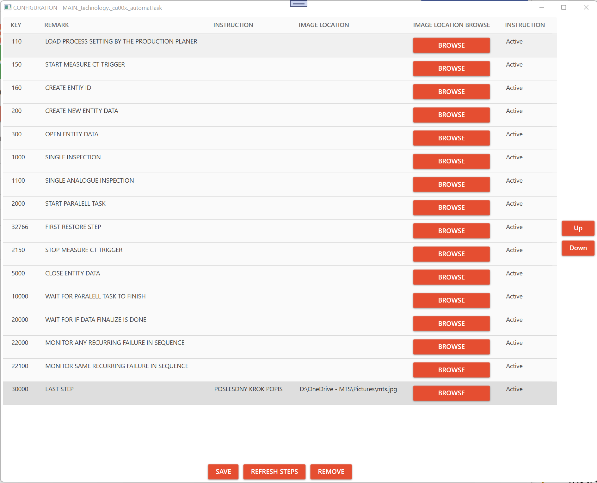


# Statistic #  

Statistic is a library used to to collect  specified data from `PlainEntityHeader` in `PlainProcessData`. Usualy collecting data is executed on update entity (OnUpdate delegate), but can be used in deferent events.(OnCreated..). The counting method  collect data and distribute it into specified process counters such are `Recipe counters`,`Error counter`,`Carrier counter`,`Rework counter`,`Hour counter`,`Shifts counter`...


#### Repository setup ####

Configuration can be stored in any repository
`
StatisticControler can be initialized in  `SetUpRepositoriesUsingRavenDb()`. It initialized with  two handlers, witch provide us data storing in repository.

- RepositoryDataSetHandler<StatisticsDataItem> - here are stored collections
- RepositoryDataSetHandler<StatisticsConfig> - config data for statistic

~~~csharp
           //Statistics
            var _statisticsDataHandler = RepositoryDataSetHandler<StatisticsDataItem>.CreateSet(new RavenDbRepository<EntitySet<StatisticsDataItem>>(new RavenDbRepositorySettings<EntitySet<StatisticsDataItem>>(new string[] { Constants.CONNECTION_STRING_DB }, "Statistics", "", "")));
            var _statisticsConfigHandler = RepositoryDataSetHandler<StatisticsConfig>.CreateSet(new RavenDbRepository<EntitySet<StatisticsConfig>>(new RavenDbRepositorySettings<EntitySet<StatisticsConfig>>(new string[] { Constants.CONNECTION_STRING_DB }, "StatisticsConfig", "", "")));


            CuxStatistic = new StatisticsDataController(ukazkaPlc.MAIN._technology._cu00x.AttributeShortName,_statisticsDataHandler,_statisticsConfigHandler);

           
            IntializeProcessDataRepositoryWithDataExchangeWithStatistic(ukazkaPlc.MAIN._technology._cu00x._processData, new RavenDbRepository<PlainProcessData>(Traceability),CuxStatistic);

            
~~~~
Usualy is data for exchange  initialized  by method `IntializeProcessDataRepositoryWithDataExchange` but if is needed collect statistic this metohod is replaced by method `IntializeProcessDataRepositoryWithDataExchangeWithStatistic`. See below
~~~csharp
    private static void IntializeProcessDataRepositoryWithDataExchangeWithStatistic(ProcessDataManager processData, IRepository<PlainProcessData> repository, StatisticsDataController cuxStatistic)
        {
            repository.OnCreate = (id, data) => { data._Created = DateTime.Now; data._Modified = DateTime.Now; data.qlikId = id; };
            repository.OnUpdate = (id, data) => { data._Modified = DateTime.Now; CuxStatistic.Count(data); };
            processData.InitializeRepository(repository);
            processData.InitializeRemoteDataExchange(repository);
        }
~~~~
> Implement these lines of code in `App.xampl.cs` in method `SetUpRepositoriesUsingRavenDb()` method in your project

**Note!**
StatisticController must be initialized before IntializeProcessDataRepositoryWithDataExchange !

#### XAML ####

Here are  examples in `OperatorView`.  To display statistic  in our application, is neccessary to add this lines of code to our `OperatorView.xaml`.
```xml
            <TabItem Header="STATISTICS CUSTOMIZED">
                <UniformGrid>
                    <view1:ErrorsDataView DataContext="{Binding StatisticViewModel}"></view1:ErrorsDataView>
                    <view1:RecipesDataView DataContext="{Binding StatisticViewModel}"></view1:RecipesDataView>
                    <view1:CarriersDataView DataContext="{Binding StatisticViewModel}"></view1:CarriersDataView>
                    <view1:ReworksDataView DataContext="{Binding StatisticViewModel}"></view1:ReworksDataView>
                </UniformGrid>

            </TabItem>
            <TabItem Header="PRODUCTION TREND">
                <UniformGrid>
                    <view1:TrendDataView DataContext="{Binding StatisticViewModel}"></view1:TrendDataView>
                 
                </UniformGrid>

            </TabItem>
            <TabItem Header="STATISTICS ADMIN">
  
                        <vortexs:PermissionBox  Permissions="Administrator|instructor_access" SecurityMode="Disabled">

                            <view1:StatisticsDataView DataContext="{Binding StatisticViewModel}"></view1:StatisticsDataView>
                        </vortexs:PermissionBox>
                 

            </TabItem>
```

We need to initialize ViewModel for `StatisticViewModel`. We can do this by initializing it  in `OperatorViewModel` constructor like this.
```csharp
  public class OperatorViewModel
    {
        public OperatorViewModel()
        {
            .
            .
            .
            StatisticViewModel = new StatisticsDataViewModel(App.CuxStatistic);
            

        }

      
        public StatisticsDataViewModel StatisticViewModel { get; private set; }
    }
```


#### Application view ####

If everthing is working properly, you should see something like this (Tables and naming will differ based on your configuration.).

> 

> 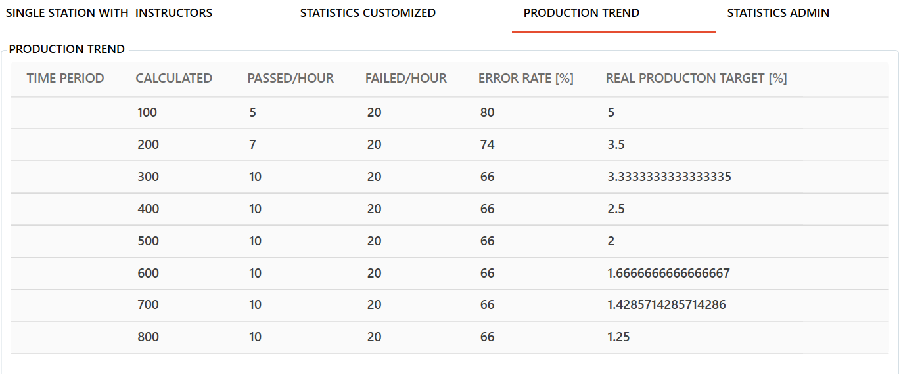

#### Admin view ####
Admin view provides  access to all tables and config tab.
> 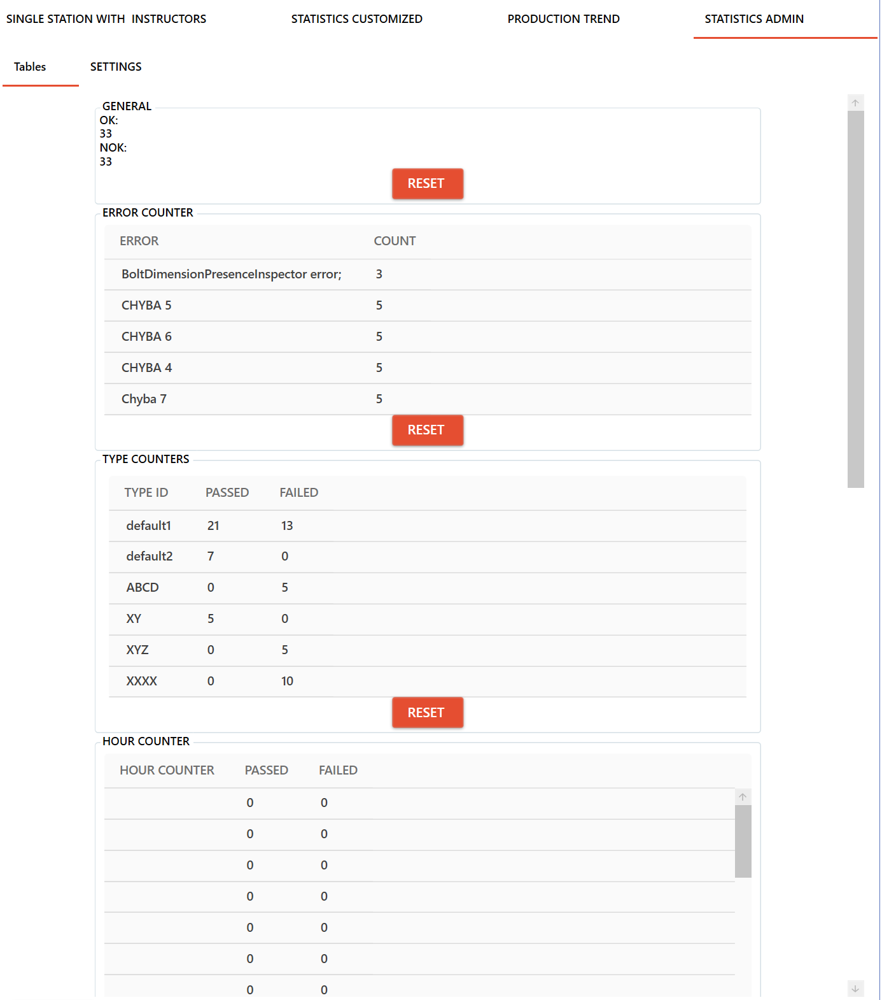

#### Admin view Config ####

> 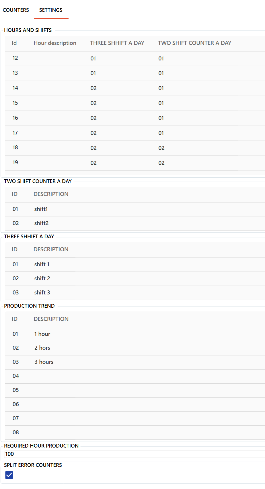
* *Key* - step uid from sequencer.
* *Remark* - step description from sequencer.
* *Instruction* - editable field that contains instruction for operator.
* *Image Location* - editable field contains full path to image to be displayed for specific instruction.

Commands:
* *Save* - saves actual configuration changes to the repository.
* *Update* - gets updated collection of steps from our class `InstructableSequecer`.
* *Remove* - removes selected entries from collection with status *Deleted*

> 


# Tag Pairing #  

Tags pairing is a  tool that facilitates the assignment of a unique key, such as an RFID (Radio Frequency Identification) chip ID, with a user-defined value in a human-readable format. This tool is designed to enable the efficient management and tracking of tagged items(pallete with RFID) by associating them with specific user-defined information.This information  can be provided as carrier identification `PlainEntityHeader` in `PlainProcessData`

#### Repository setup ####

Configuration can be stored in any repository


~~~csharp
           //Raven embded
           CuxTagsPairing = new TagsPairingController(RepositoryDataSetHandler<TagItem>.CreateSet(new RavenDbRepository<EntitySet<TagItem>>(new RavenDbRepositorySettings<EntitySet<TagItem>>(new string[] { Entry.Settings.GetConnectionString() }, "TagsDictionary", "", ""))), "TagsCfg"); ;

            //mongodb
            CuxTagsPairing = new TagsPairingController(RepositoryDataSetHandler<TagItem>.CreateSet(new MongoDbRepository<EntitySet<TagItem>>(new MongoDbRepositorySettings<EntitySet<TagItem>>(Entry.Settings.GetConnectionString(), Entry.Settings.DbName, "TagsDictionary"))), "TagsCfg");

            
~~~~


> Implementation of these lines are stored in `App.xaml.cs` 

**Note!**
There can be created various sets defined by custom name. In this example it is used `TagsCfg`. This set is stored in `TagsDictionary collection`.!

## XAML 

Here are  examples in `OperatorView`.  To display this tool  in our application, is necessary to add this lines of code to our `OperatorView.xaml`.
```xml
          <TabItem Header="TAGS PAIRING">

                <vortexs:PermissionBox  Permissions="Administrator|instructor_access" SecurityMode="Disabled">

                    <view2:TagsPairingView DataContext="{Binding TagsPairingViewModel}"></view2:TagsPairingView>
                </vortexs:PermissionBox>


            </TabItem>

```

We need to initialize ViewModel for `TagsPairingViewModel`. We can do this by initializing it  in `OperatorViewModel` constructor like this.

```csharp
  public class OperatorViewModel
    {
        public OperatorViewModel()
        {
            .
            .
            .
             TagsPairingViewModel = new TagsPairingViewModel(App.CuxTagsPairing);
            

        }

      
        
        public TagsPairingViewModel TagsPairingViewModel { get; private set; }
    }
```

## Application view

If everthing is working properly, you should see something like this (Tables and naming will differ based on your configuration directili in project.).

> 

## Configuration table


* *Key* - The Key is ID  of the tag's Uid
* *AssignedValue* - user-defined value in a human-readable format
* *Description* - additional string information dedicated for note
* *Status* -  is an enumerated value. Defined tag status .

~~~csharp
  public enum EnumItemStatus
    {
        Unknown = 0,
        Active = 10,
        Inactive = 20
    }
~~~

* *FirstUse* -  first time tag was assigned .
* *LastUse* -  last known time when tag was assigned .
* *NumberOfUse* -  counter value, defined how many times was carrier with specified uid requested(used)
Commands:
* *Save* - saves actual configuration changes to the repository.
* *Remove* - removing items is possible to provide directly on table by selecting line and press `Delete key` 

## Add tag manualy (Via UI) 

> 

## Get  tag manualy (Via UI) 

On picture below is show info abut tag and assigned  values.

> 
> 

There is a general result enumerator that provides information about requested operations, known as the `EnumResultsStatus`. This enumerator enables the standardized communication of operation outcomes. The general result can be transferred to a PLC or utilized as custom information in the user interface (UI).

~~~csharp
 public enum EnumResultsStatus
    {
        // these results are used when we are requesting tag
        TagFound = 0,
        TagFoundInactive = 10,
        TagFoundAssignedValueEmpty =20,
        TagFoundUnknown = 30,
        TagNotFound = 40,
        //these results are used when we are requesting insertion new into collection
        TagAlreadyExist = 50,
        TagAddedSuccessfully = 60,
        TagAddedNotSuccessfuly = 70,
        EmptyCollection = 100,
       
    }
~~~

## PLC EXAMPLE

### Definition and implementation

* *Create function as a wrapper* - witch extending `TcoCore.TcoRemoteTask. Here we can pot some members witch are necessary.

~~~pascal
    FUNCTION_BLOCK PairTagTask EXTENDS TcoCore.TcoRemoteTask
    VAR
        
        _key: STRING;
        _assignedValue : STRING;	
        _answerInstruction : STRING(254);
        _answer: TagsPairing;
        {attribute 'hide'}
        _answerClean: TagsPairing;
        _mode: eTagPairingMode;
    END_VAR
~~~

* *Define method witch will be a trigger for remote exec*

~~~pascal
METHOD Run : REFERENCE TO PairTagTask
VAR_INPUT
	(*~
	<docu>
		<summary>
			The mode is type of operation to be done by invoking  this remote task.(GetTag,CreateTag...)
		</summary>						
	</docu>	
	~*)
	inMode :eTagPairingMode;
	(*~
	<docu>
		<summary>
			The Key is ID  of the tag's Uid on which assigned value will be found . 	
		</summary>						
	</docu>	
	~*)
	inKey : STRING;
		(*~
	<docu>
		<summary>
			The AAssignedValue is user defined additional value, this value provide  better undersanding identification of carriers . 	
		</summary>						
	</docu>	
	~*)
	inAssignedValue : STRING;
	
END_VAR

~~~
body will looks like this
~~~pascal
THIS^._key := inKey;
THIS^._mode := inMode;
THIS^._assignedValue := inAssignedValue;


Run REF= THIS^;
~~~

* *Definition PC side -initialize  remote exec*

~~~csharp
   // initialize custom remote tasks here
    Action assignTagValeAction = () => TagsPairingOperation(ukazkaPlc.MAIN._technology._cu00x._components.PairTagTask);
    ukazkaPlc.MAIN._technology._cu00x._components.PairTagTask.InitializeExclusively(assignTagValeAction);
~~~

* *Example in PC side* 

~~~csharp
    /// <summary>
    /// this is remontely invoked from plc , 
    /// </summary>
    /// <param name="pairTagTask"></param>
    private void TagsPairingOperation(PairTagTask pairTagTask)
    {
        pairTagTask.Read();

        TagItem currentItem = new TagItem();
        EnumResultsStatus result;
        switch ((eTagPairingMode) pairTagTask._mode.Cyclic)
        {
            case eTagPairingMode.GetTag:
                CuxTagsPairing.GetTag(pairTagTask._key.Cyclic, out currentItem, out result);
                pairTagTask._answer.AssignedValue.Cyclic = currentItem.AssignedValue;
                pairTagTask._answer.Status.Cyclic =(short)currentItem.Status;
                pairTagTask._answer.Answer.Cyclic = (short)result;
                pairTagTask._answerInstruction.Cyclic = "";
                break;
            case eTagPairingMode.RemoveTag:
                //not used , for removing use UI
                break;
            case eTagPairingMode.AddTag:
                CuxTagsPairing.AddTag(new TagItem() {Key= pairTagTask._key.Cyclic, AssignedValue= pairTagTask._assignedValue.Cyclic}, out result);
                pairTagTask._answer.Answer.Cyclic = (short)result;
                pairTagTask._answerInstruction.Cyclic = "";
                break;
            default:
                break;
        }
    }
~~~

### USAGE in PLC application
Plc remote call

~~~ pascal
IF (Step(inStepID, _tagsPairing, '<#PAIR TAG WITH ASSIGNED VALUE EXAMPLE#>')) THEN
    //-------------------------------------
	_addNewTag:=FALSE;

	answer:= Station.Components.PairTagTask.Answer;
	//this field may be assigned by unique ID of rfid chip , or dmc code.The PairTagTask provide answer where is assigned user defined value for this unique ID value.
	//If not, there may be diferent scenarios defined. See example bellow.
	_reqKey:='123456789';				   
	 IF Station.Components.PairTagTask.Run(inMode:=eTagPairingMode.GetTag, inKey:=_reqKey ,inAssignedValue:='').Invoke().Done	 THEN
		
		IF  answer.Answer =eTagPairingAnswer.TagFound 
			 THEN
			Station.ProcessDataManager.Data.EntityHeader.Carrier := answer.AssignedValue;
			CompleteStep();
			Station.Components.PairTagTask.Restore();
		
		ELSIF  answer.Answer = eTagPairingAnswer.TagFoundInactive THEN
			IF (_dialog.Show()
			   .WithCaption('<#Pairing Tag#>')
			   .WithText(_sb.Clear().Append('<#Founded tag #>').Append(_reqKey).Append('<# is inactive! #>').Append(Station.Components.PairTagTask.AnswerInstruction).ToString() )
				.WithOk().Answer = TcoCore.eDialogAnswer.OK) THEN;
				;// Founded tag is Inactive. Probably carier(pallete) was disasbled due produced many errors.Se  here you can write diferent scenario ( leave it with current state , provide ground etc)	 
		
				//Station.GroundTask.Task.Invoke();
			   
			End_if;
		
		ELSIF  answer.Answer = eTagPairingAnswer.TagFoundAssignedValueEmpty THEN
			  IF (_dialog.Show()
			   .WithCaption('<#Pairing Tag#>')
			   .WithText(_sb.Clear().Append('<#Tag #>').Append(_reqKey).Append('<# is founded but assigned value is empty! Would you like continue? #>').Append(Station.Components.PairTagTask.AnswerInstruction).ToString() )
				.WithYesNo().Answer = TcoCore.eDialogAnswer.Yes) THEN;
				CompleteStep();
				Station.Components.PairTagTask.Restore();
			END_IF;
		   
		ELSIF  answer.Answer = eTagPairingAnswer.TagNotFound THEN
			  IF (_dialog.Show()
			   .WithCaption('<#Pairing Tag#>')
			   .WithText(_sb.Clear().Append('<#Tag #>').Append(_reqKey).Append('<# is not founded ! Would you like assign right now? #>').Append(Station.Components.PairTagTask.AnswerInstruction).ToString() )
				.WithYesNo().Answer = TcoCore.eDialogAnswer.Yes) THEN;
				_addNewTag:=TRUE;
				CompleteStep();
				Station.Components.PairTagTask.Restore();
			END_IF;
	
		
			ELSIF  answer.Answer = eTagPairingAnswer.EmptyCollection THEN
			  IF (_dialog.Show()
			   .WithCaption('<#Pairing Tag#>')
			   .WithText(_sb.Clear().Append('<#Tag #>').Append(_reqKey).Append('<# is not founded due collection is empty ! Would you like assign right now? #>').Append(Station.Components.PairTagTask.AnswerInstruction).ToString() )
				.WithYesNo().Answer = TcoCore.eDialogAnswer.Yes) THEN;
				_addNewTag:=TRUE;
				CompleteStep();
				Station.Components.PairTagTask.Restore();
			END_IF;
		End_if;
			
	END_IF		    				
    //-------------------------------------
END_IF

IF (Step(inStepID+10, _tagsPairing AND _addNewTag, '<#ADD NEW TAG  EXAMPLE#>')) THEN
    //-------------------------------------
	
	answer:= Station.Components.PairTagTask.Answer;
	//this field may be assigned by unique ID of rfid chip , or dmc code.The PairTagTask provide answer where is assigned user defined value for this unique ID value.
	//If not, there may be diferent scenarios defined. See example bellow.
	_reqKey:='123456789';		
	_reqAssignedValue := 'CustomIdExample123';	   
	 IF Station.Components.PairTagTask.Run(inMode:=eTagPairingMode.AddTag, inKey:=_reqKey, inAssignedValue:=_reqAssignedValue).Invoke().Done	 THEN
		
		IF  answer.Answer =eTagPairingAnswer.TagAddedSuccessfully 
			 THEN
			Station.ProcessDataManager.Data.EntityHeader.Carrier := answer.AssignedValue;
			CompleteStep();
			Station.Components.PairTagTask.Restore();
		END_IF;
	ELSIF  answer.Answer = eTagPairingAnswer.TagAlreadyExist THEN
		IF (_dialog.Show()
	       .WithCaption('<#Adding Tag#>')
		   .WithText(_sb.Clear().Append('<#Tag #>').Append(_reqKey).Append('<# already exist! #>').Append(Station.Components.PairTagTask.AnswerInstruction).ToString() )
			.WithOk().Answer = TcoCore.eDialogAnswer.OK) THEN;
			;// Founded tag is Inactive. Probably carier(pallete) was disasbled due produced many errors.Se  here you can write diferent scenario ( leave it with current state , provide ground etc)	 
	
		 	//Station.GroundTask.Task.Invoke();
		   
		End_if;
	
	ELSIF  answer.Answer = eTagPairingAnswer.TagAddedNotSuccessfuly THEN
			dialogAnswer := _dialog.Show()
	       .WithCaption('<#Pairing Tag#>')
		   .WithText(_sb.Clear().Append('<#Tag #>').Append(_reqKey).Append('<# was not founnd! Would you like still like to continue? #>').Append(Station.Components.PairTagTask.AnswerInstruction).ToString() )
			.WithYesNo().Answer;
			
	      IF (dialogAnswer= TcoCore.eDialogAnswer.Yes) THEN;
			CompleteStep();
			Station.Components.PairTagTask.Restore();
		END_IF;
		   

			
	END_IF		    				
    //-------------------------------------
END_IF
~~~

Output will be
> 